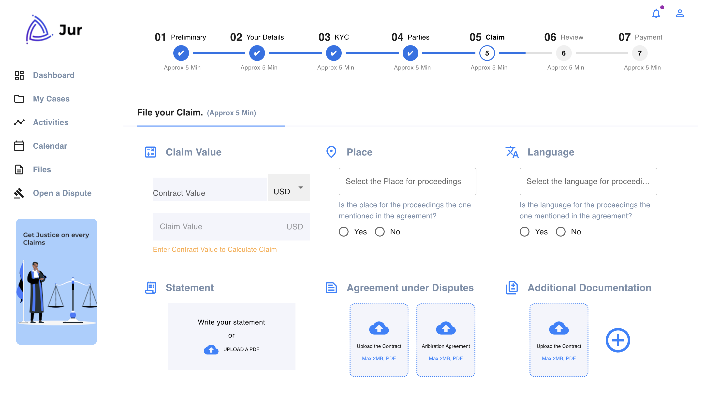
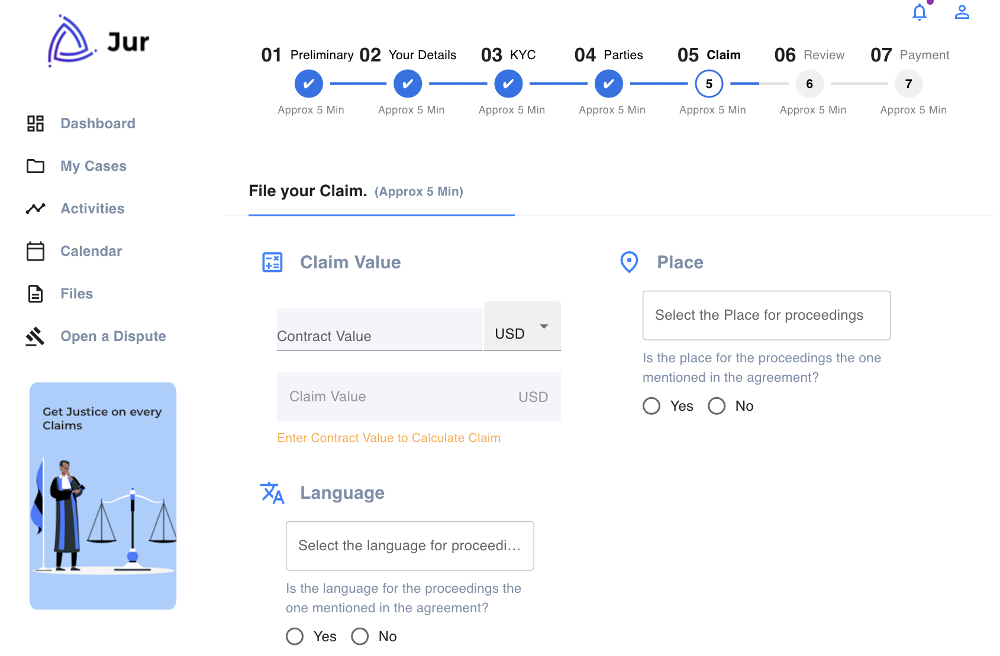
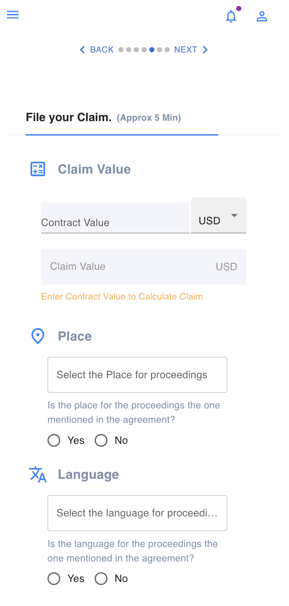

# Project Name: Construction Dashboard

## Overview

This project is a dynamic, responsive dashboard that tracks progress through multiple steps, built using React and Material UI. The project includes a visual representation of each step using a progress bar and a mobile-friendly stepper to navigate through the process. It allows users to seamlessly progress through steps like Preliminary, Your Details, KYC, etc., and navigate based on their current status.

## Approach

### 1. **Project Setup**
   - The application was built using **React** for the frontend, along with **Material UI (MUI)** for styling and components.
   - The project utilizes **React Router** to navigate through the different pages corresponding to each step.
   - We created a custom progress bar using MUI’s `Box`, `Typography`, and `StepLine` components.

### 2. **Stepper Design**
   - The **ProgressBar** component represents a visual progress tracker that shows the user's current progress through various steps. 
   - On clicking any step, the application navigates to that specific page, updating the visual indicator to reflect the current step.
   - **MobileStepper** is used for a mobile-friendly view. It only displays on small screens (mobile or tablet) and provides buttons to navigate forward and backward through the steps.
   - The **Responsive Design** is handled by using **MUI’s breakpoints** to show different elements based on the screen size. For larger screens, the progress bar is visible, while for smaller screens, the mobile stepper is shown.

### 3. **Navigation Logic**
   - The navigation logic is handled using `useNavigate` from React Router, which allows us to programmatically navigate to different pages when a step is clicked or when the next/back buttons are pressed.
   - The routing is managed by associating each step with a specific URL path such as `/preliminary`, `/yourdetails`, `/kyc`, etc.

### 4. **Responsive Design**
   - The dashboard is fully responsive. It adapts to the screen size by switching between a **ProgressBar** and a **MobileStepper** depending on the device width.

## Challenges Faced & Solutions

### 1. **Handling Navigation Logic with Progress**
   - Initially, I struggled with implementing the step navigation logic because the `handleStepClick` function needed to correctly map the step to a specific route.
   - **Solution**: I used `useNavigate` from React Router to programmatically change routes when a step was clicked, and also ensured that the correct step was highlighted based on the `currentStep` state.

### 2. **Responsive Design Issues**
   - Ensuring that the progress bar and stepper were responsive to different screen sizes was challenging. The mobile stepper needed to be hidden on large screens, and vice versa for the progress bar.
   - **Solution**: I leveraged **MUI’s Grid** and **Box** components, along with **CSS breakpoints**, to control which element was visible based on the screen size.

### 3. **Step Transitions & User Experience**
   - I had difficulty ensuring a smooth transition between steps and keeping track of the progress.
   - **Solution**: I used state management within the `ProgressBar` component to manage the `currentStep`. This allowed for a smooth update and clear transition as the user clicked on different steps or navigated with the mobile stepper.

## Assumptions Made

1. **React Router**: It was assumed that the application would use **React Router** for navigation between different pages, each representing a step in the process.
2. **Step Order**: The steps are assumed to be followed in a sequential order. Each step must be completed before moving to the next.
3. **Mobile-First**: The design assumes a mobile-first approach, showing a mobile stepper on smaller screens and a progress bar on larger screens.


# My Dashboard Views

## Desktop View


## Tablet View


## Mobile View



## Installation

To run the project locally, follow these steps:

1. **Clone the repository**:

   ```bash
   git clone <repository-url>

2. **Install dependencies**:

Navigate into the project directory and install the required dependencies:
    ```bash
    cd <project-name>
    npm install

3. **Start the application**:

After installing the dependencies, you can run the app with:
    ```bash
    npm run dev

This will start the application and open it in your browser at http://localhost:5173.


## Technologies Used
React: For building the user interface.
Material UI (MUI): For UI components and responsive design.
React Router: For navigation between different pages.
CSS: For additional styling and responsiveness.

## Future Improvements
1. Form Validation: Add form validation for each step where necessary, especially for "Your Details" and "KYC" steps.
2. API Integration: Implement API calls to fetch real-time data for steps like "Review" and "Payment".
3. User Authentication: Add a user authentication system to personalize the experience and track progress for different users.
4. Accessibility: Improve the accessibility of the dashboard by adding more semantic HTML elements and keyboard navigability.

## Contributing
Feel free to fork the project and submit pull requests with improvements or bug fixes. For major changes, please open an issue first to discuss what you would like to change.Please make sure to update the documentation accordingly. Thank you for contributing!


